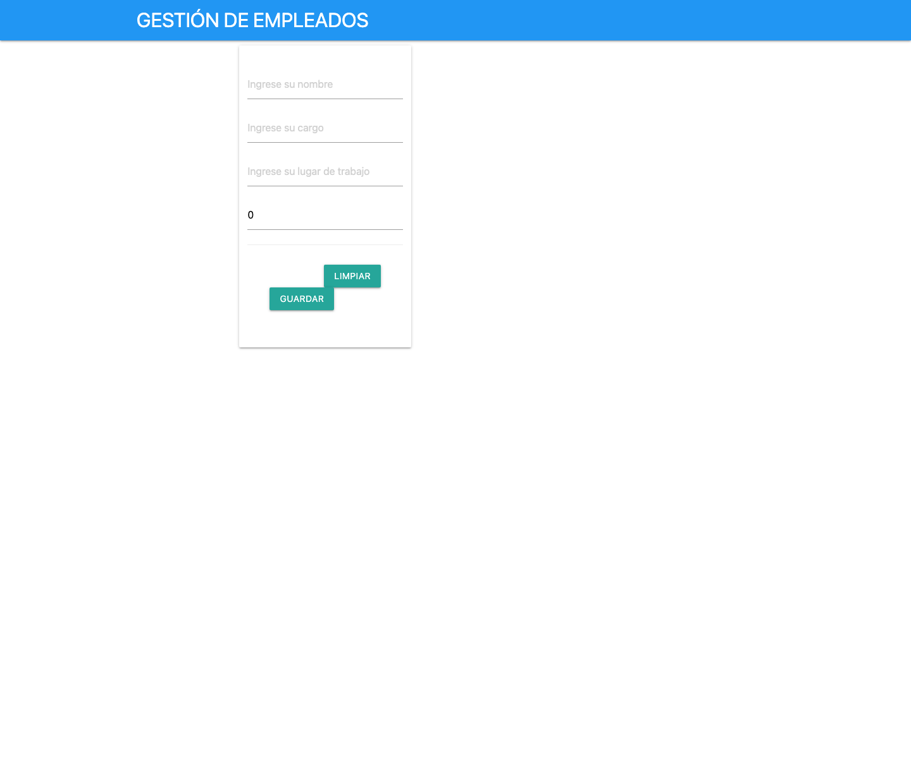

# Gestión de Empleados - Frontend Angular

Frontend Angular para una evidencia SENA de gestión de empleados. Permite capturar datos de empleado y consumir una API REST local en `http://localhost:3000/api/empleados`.

<p align="center">
  
</p>

## Resumen

La aplicación muestra un formulario para registrar empleados con nombre, cargo, lugar de trabajo y salario. El servicio `EmpleadoService` está preparado para operaciones CRUD contra un backend Express/MongoDB o API compatible.

## Características

- Formulario de creación de empleados.
- Modelo `Empleado` con `_id`, `name`, `position`, `office` y `salary`.
- Servicio Angular para listar, crear, actualizar y eliminar empleados.
- Consumo de API REST en `http://localhost:3000/api/empleados`.
- UI basada en clases Materialize/CSS.

## Stack

- Angular 16
- TypeScript
- RxJS
- Angular Forms
- Angular CLI

## Instalación

```bash
npm ci
npm start
```

Abrí `http://localhost:4200`.

## Backend Esperado

El frontend espera una API disponible en:

```text
http://localhost:3000/api/empleados
```

Endpoints usados por el servicio:

```text
GET    /api/empleados
POST   /api/empleados
PUT    /api/empleados/:id
DELETE /api/empleados/:id
```

## Validación Local

La imagen del README fue capturada desde la app ejecutándose en `http://127.0.0.1:3020`.

Comandos validados:

```bash
npm ci
npm run build
npm start -- --host 127.0.0.1 --port 3020
```

`npm run build` finalizó correctamente.

## Estructura Relevante

```text
src/app/components/empleados/   # Formulario de empleados
src/app/models/empleado.ts      # Modelo de empleado
src/app/services/empleado.service.ts # Cliente HTTP para API REST
src/app/app.component.html      # Layout principal
```

## Nota

La captura muestra el frontend aislado. Para guardar/listar empleados se debe ejecutar también el backend compatible en el puerto `3000`.
